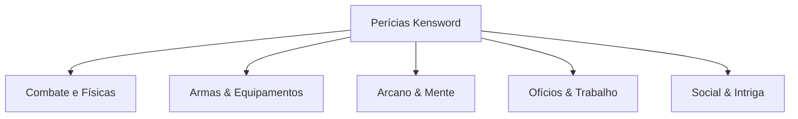

# 🎓 Sistema de Perícias & Especializações

> [!IMPORTANT]
> **A Importância das Perícias no RPG**
> * **Requisito de Habilitação**: É obrigatório possuir a perícia correspondente para conseguir utilizar uma área do jogo ou empunhar armas eficientemente. Sem a perícia, o personagem é considerado **Totalmente Inexperiente**, sofrendo penalidades críticas ou incapacidade de ação naquela área.
> * **Progressão de Escalonamento**: O nível das perícias varia do **Lvl 1 (Iniciante)** ao **Lvl 10 (Expert / Limite)**.

---

### 📊 Requisitos de Progressão de Perícias (XP)

| Nível da Perícia | Requisito de Experiência (XP) | Status de Proficiência |
| :--- | :--- | :--- |
| **Sem Perícia** | `-` | Totalmente Inexperiente (Penalidades Graves) |
| **Lvl 1** | `[00 / 1.000 XP]` | Aprendiz / Iniciante |
| **Lvl 2** | `[00 / 1.500 XP]` | Praticante |
| **Lvl 3** | `[00 / 2.000 XP]` | Habilitado (Desbloqueia Habilidades Derivadas Comuns) |
| **Lvl 4** | `[00 / 2.500 XP]` | Proficiente |
| **Lvl 5** | `[00 / 3.000 XP]` | Veterano (Desbloqueia Habilidades Derivadas Intermediárias) |
| **Lvl 6** | `[00 / 3.500 XP]` | Elite |
| **Lvl 7** | `[00 / 4.000 XP]` | Mestre de Campo |
| **Lvl 8** | `[00 / 4.500 XP]` | Grão-Mestre (Permite treinar outros em dupla) |
| **Lvl 9** | `[00 / 5.000 XP]` | Lenda Viva |
| **Lvl 10** | `[00 / 5.500 XP]` | Expert (Eficiência Máxima / Sem Limitações) |

---

### 💡 Sugestões de Efeitos e Recompensas por Perícia

> [!TIP]
> **Por que focar em Perícias?**
> * **Bônus de Combate/Armas**: Cada nível investido na perícia da arma empunhada concede um bônus passivo de **+2% de Dano Físico e Acerto** (limite de +20% no Lvl 10).
> * **Bônus de Magia / Apoio**: Concede **+2% de Eficiência Mágica, Cura ou Velocidade de Conjuração** por nível naquela escola mágica (limite de +20% no Lvl 10).
> * **Bônus de Defesa / Sobrevivência (Esquiva, Bloqueio, Resiliência)**: Concede **+2% de chance de ativação ou redução de dano bem-sucedida** por nível (limite de +20% no Lvl 10).
> * **Bônus de Ofícios (Metalurgia, Alquimia, Síntese)**: Concede **+3% de chance de sucesso de fabricação** ou **+2% de atributos adicionais** concedidos aos equipamentos e itens criados por nível.

---

### 🗂️ Compêndio de Perícias Oficiais

#### 1. Combate & Aptidões Físicas
* **Combate**: Habilidade de luta geral.
* **Arte Marcial**: Combate corpo a corpo desarmado.
* **Vitalidade**: Expansão do vigor físico geral.
* **Resistência**: Suporte a impactos físicos.
* **Resiliência**: Tolerância a dores, venenos e efeitos adversos.
* **Bloqueio**: Absorção de impacto utilizando antebraços ou escudos.
* **Esquiva**: Reflexos de evasão.
* **Agilidade**: Velocidade de deslocamento e flexibilidade.

#### 2. Armas & Equipamentos
* **Adaga** | **Espada** | **Katana** | **Lança** | **Alabarda** | **Espadão** | **Machado** | **Foice** | **Martelo** | **Maça** | **Escudo** | **Ioiô** | **Cajado** | **Grimório**
* **Arco e flecha** *(Observação: A velocidade de ataque depende da arma utilizada)*

#### 3. Arcanismo & Mente
* **Magia**: Conhecimento e manipulação de fluxos de mana e magias ativas.
* **Inteligência**: Capacidade de raciocínio lógico, estratégias e sabedoria.
* **Magia de apoio**: Conjuração de feitiços de cura, buffs, purificação e barreiras.
* **Concentração**: Foco mental absoluto, resistência a interrupções de conjuração.
* **Percepção**: Visão de combate, identificação de armadilhas e pontos fracos.
* **Furtividade**: Movimentação silenciosa e ocultação em sombras.
* **Manuseio**: Precisão fina com as mãos, destreza e gatilhos rápidos.
* **Precaução**: Sentido de alerta contra emboscadas e ataques surpresa.
* **Encantar**: Aplicação de efeitos mágicos temporários em itens e armas.

#### 4. Ofícios, Trabalho & Exploração
* **Agricultura** | **Pecuária** | **Culinária** | **Mineração** | **Artesanato** | **Metalurgia** | **Síntese** | **Estilismo** | **Caça** | **Monstros** | **Ciência** | **Alquimia** | **Masmorra**
* **Conhecimento da Flora** | **Conhecimento da Fauna**

#### 5. Social & Intriga
* **Comunicação** | **Negociação** | **Sedução** | **Drenagem Vital** | **Manipulação**
* **Social (Reconhecimento)**:
  * **Lvl 1**: Desconhecido
  * **Lvl 2**: Reconhecido pela Plebe
  * **Lvl 3**: Reconhecido pela Burguesia
  * **Lvl 4**: Reconhecido pela Nobreza
  * **Lvl 5**: Reconhecido pela Realeza

---
---

# 🏋️ Sistema de Treinamento

> [!IMPORTANT]
> **Mecânica de Treinos no Web Portal**
> No portal do Kensword Chronicles, **não há sistema de treinos baseados em escrita manual**. Os treinos são totalmente automatizados através do **Sistema de Treino AFK** processado pelo servidor do site.

---

### 📈 Recompensas de Treino Ativo (Referência de Equivalência)

| Tipo de Treino | Recompensas Disponíveis | Limites Semanais |
| :--- | :--- | :--- |
| **Treino Solo** | +100 XP (Level) • +100 XP (Perícia) • +15 Pontos Base `[+5 × Lvl]` para distribuir | **Máx. 3 vezes** por semana |
| **Treino Em Dupla** | +300 XP (Level) • +600 XP (Perícia) • +25 Pontos Base `[+5 × Lvl]` para distribuir *(Mínimo de 5 cenas por jogador)* | **Máx. 2 vezes** por semana |
| **Treino De Aptidão** | +1% de Aptidão Elemental • +100 XP (Perícia) • +5 Pontos Base `[5 × Lvl]` para distribuir | **Máx. 2 vezes** por semana |
| **Treino De Perícia / Trabalho** | +100 XP (Level) • +100 XP (Perícia/Trabalho) • +5 Pontos Base `[+5 × Lvl]` para distribuir | **Máx. 1 vez** por semana por perícia |
| **Treino De Magia** | +1% de Aptidão Elemental • +15 Pontos de Magia `[+5 × Lvl]` | **Máx. 2 vezes** por semana |

> [!NOTE]
> * **Início de Escalonamento de Pontos**: A fórmula `+5 × Lvl` refere-se ao nível atual da perícia ou personagem que está sendo treinado, aumentando o rendimento dos treinos conforme o jogador avança.

---

### ⏳ Sistema de Treino AFK (Exclusivo Web Portal)

O Treino AFK é o método padrão da plataforma para jogadores que possuem tempo limitado para jogar ativamente, permitindo que evoluam de forma justa.

* **Regras de Funcionamento e Condições**:
  * **Janela Ativa de Treino**: O sistema processa os treinos diariamente das **06:00 às 00:00**.
  * **Liberdade de Ação**: Colocar o personagem em Treino AFK **NÃO** bloqueia o uso dele no portal. O personagem continua livre para interagir no site, equipar itens e participar das atividades normais.
  * **Taxa de Conversão Temporal**: A cada **1 hora real** decorrida em estado AFK, é contabilizado **1 treino**.
  * **Escalonamento e Limites**: O Treino AFK consome os slots e obedece rigidamente aos mesmos limites semanais de pontos, XP e aptidão descritos na tabela de treinos ativos.
  * **Reset do Compêndio Semanal**: Todos os limites semanais de treinos são resetados aos **Domingos, às 21h**.
